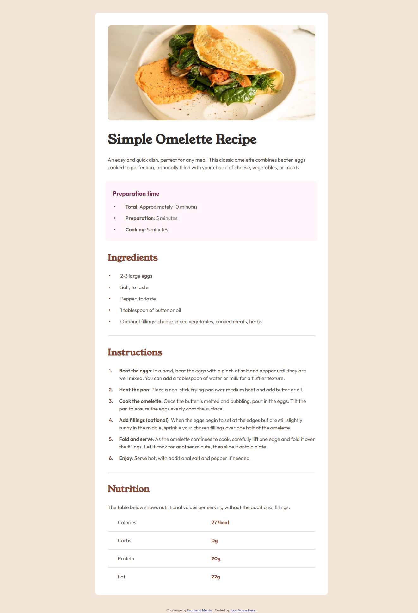
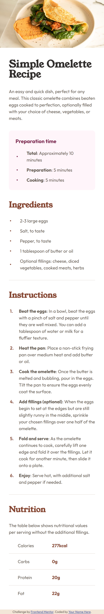

# Frontend Mentor - Recipe page solution

This is a solution to the [Recipe page challenge on Frontend Mentor](https://www.frontendmentor.io/challenges/recipe-page-KiTsR8QQKm). Frontend Mentor challenges help you improve your coding skills by building realistic projects. 

## Table of contents

- [Overview](#overview)
  - [The challenge](#the-challenge)
  - [Screenshot](#screenshot)
  - [Links](#links)
- [My process](#my-process)
  - [Built with](#built-with)
  - [What I learned](#what-i-learned)
  - [Continued development](#continued-development)
  - [Useful resources](#useful-resources)
  - [AI Collaboration](#ai-collaboration)
- [Author](#author)
- [Acknowledgments](#acknowledgments)

## Overview

### Screenshot

### Links

- Solution URL: https://github.com/sanei-i/recipe-page
- Live Site URL: https://recipe-page-sanei-i.netlify.app/

## My process

### Built with

- Semantic HTML5 markup
- CSS custom properties
- Flexbox
- CSS Grid

### What I learned

Through this project, I learned how to build a more semantic HTML structure and create responsive layouts using clamp(), Flexbox, and CSS Grid.

### Continued development

Through this project, I became more interested in responsive design and semantic HTML, and I would like to continue improving these skills.

### AI Collaboration

I also learned more about semantic elements like ul, ol, li, and table by asking ChatGPT questions while building the project.

## Author

- GitHub - [sanei-i](https://github.com/sanei-i)
- Frontend Mentor - [sanei-i](https://www.frontendmentor.io/profile/sanei-i)
